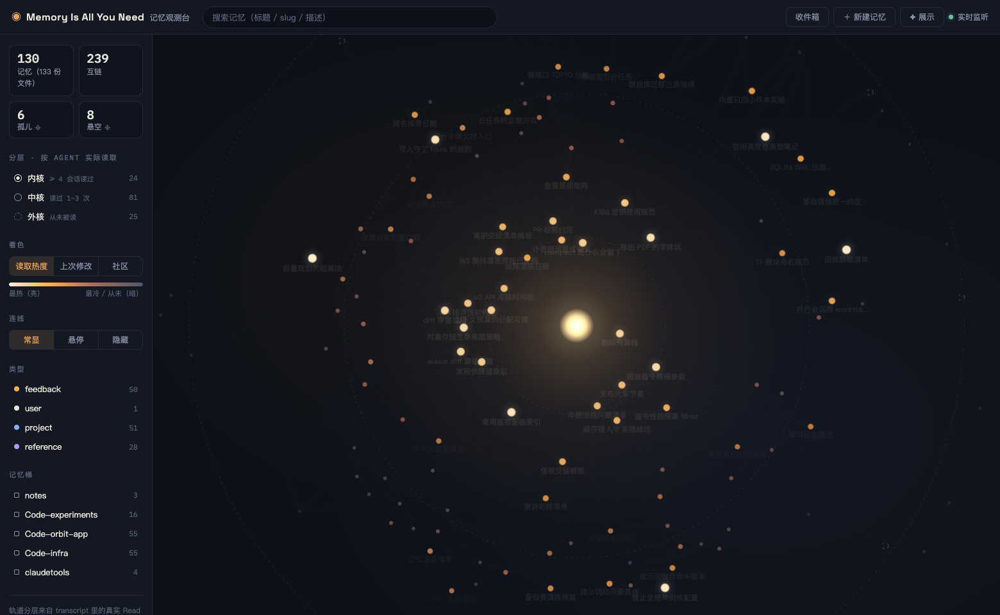
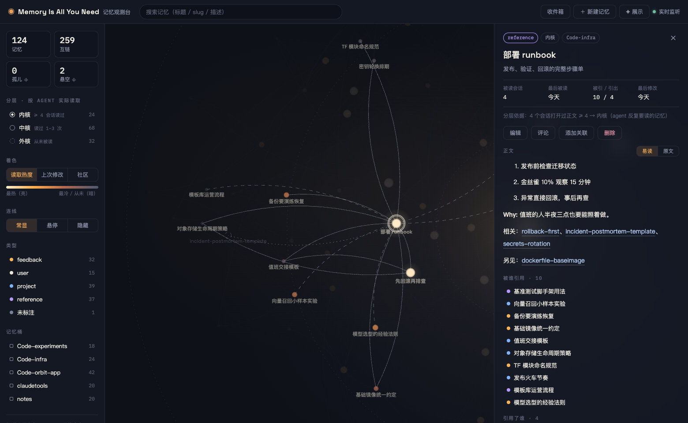

# Memory Is All You Need 🔭

**English** | [简体中文](./README.zh-CN.md)

> Your agent reads and writes memory every day. When was the last time you actually *saw* that memory?



## Start with Anthropic's four quadrants

In the official blog post [*A field guide to Claude Fable 5: Finding your unknowns*](https://claude.com/blog/a-field-guide-to-claude-fable-finding-your-unknowns), Anthropic maps the information between you and your agent into four quadrants:

| Quadrant | The original definition | What it looks like |
|---|---|---|
| **Known knowns** | "This is essentially what is in my prompt." — what you explicitly tell the agent | Requirements, constraints, acceptance criteria |
| **Known unknowns** | What you're aware you haven't figured out yet | Open design decisions — what the conversation itself is for |
| **Unknown knowns** | "What's so obvious I'd never write it down, but would recognize it if I saw it?" | Conventions: you cut paper with scissors, not a chisel; your father's father is your grandfather |
| **Unknown unknowns** | What you haven't considered at all | Blind spots — the post recommends a literal "blindspot pass" to flush them out |

Most task outcomes are decided by the quality of the first quadrant: the agent only knows what you tell it. But retyping the same constraints in every conversation doesn't scale — that's what **memory** is for: write it down once, and it's injected into every future session.

**Memory is the persistence layer of your known knowns.**

## But that layer is invisible

Anthropic built [Claude Code's memory](https://code.claude.com/docs/en/memory) as plain files: one `~/.claude/projects/<project>/memory/` directory per project, indexed by `MEMORY.md` (its first 200 lines / 25KB are injected into every session), bodies read on demand, entries cross-linked with `[[wikilink]]`.

Plain files mean transparency, editability, no lock-in — all good. They also mean your memory is just a pile of markdown sitting in a folder: **you can't see its overall shape, you can't see how entries relate, and you can't see whether the agent ever actually uses any of it.**

Memory Is All You Need is an observatory built for this quadrant. It turns memory into an interactive star map — every entry a glowing body, wikilinks as gravity, and each node's orbit decided by a fact you can't see anywhere else: **how many real sessions the agent actually read it in.** Then it sends pipelines out to hunt the other quadrants and haul the catch back into this layer.

## Four questions it answers

**1. What does it actually remember?**
Browsing memory used to mean opening files one by one in an editor. Now it's a force-directed star map plus a full-text drawer: search, filter, three coloring modes (read heat / last modified / community clusters) — the shape of hundreds of memories at a glance. Read heat is the default view: the map opens on the question that matters most.

**2. How do the memories relate?**
`[[wikilink]]`s are buried in file bodies where you can't see them. Now they're visible edges, Louvain auto-communities, and one-click lenses for orphan nodes and dangling references. Select any memory and its neighborhood lights up — everything else recedes:



**3. Is the agent actually using them?**
The darkest corner of the black box. The observatory scans every session transcript (subagents included) for real `Read` events, and sorts memories into three orbits:

| Orbit | Criterion | Meaning |
|---|---|---|
| Kernel | body read in ≥ 4 sessions | memories the agent truly relies on |
| Mid | read 1–3 times | occasionally needed |
| Outer | **never read** | dead-memory candidates — index lines injected every session, burning tokens for nothing |

Not guessed. Not model-scored. Counted.

**4. Where does memory come from?**
No longer just "hey, remember this" — see the supply side below.

## Supply side: hauling from the other quadrants

| Pipeline | What it hauls | Uses an LLM? |
|---|---|---|
| The observatory itself | Keeping known knowns in order: manage, prune, locate dead memories | No |
| `npm run mine` | **Escapees** from your known knowns: constraints you've retyped across prompts but never persisted (3-gram sentence clustering + union-find, with six layers of noise defense) | No |
| `npm run scan:feishu` | **Unknown knowns**: tacit knowledge you never thought to write down, scattered through your own Feishu (Lark) messages. The review card is exactly the moment the post describes — "recognize it if I saw it" | Draft only |
| Decision Q&A capture (planned) | **Unknown unknowns**: proactive questioning that forces blind spots into the open — a persisted blindspot pass | — |

(Known unknowns need no pipeline — things you know you haven't figured out belong to the conversation itself.)

## Humans in the loop — but only to nod

The tool's stance: **seeing and drafting are the tool's job; writing memory is always done by Claude Code itself** (through its own write conventions). You only make decisions.

- **Comment → revise**: leave a comment on any memory in the observatory → the next Claude Code session gets it injected via a SessionStart hook → CC edits the memory itself and marks the comment done.
- **Candidate → review → write**: supply pipelines drop candidates into an inbox (`.lens-inbox.jsonl` per bucket) → a Feishu card lands in your private group with **"remember / skip" callback buttons that update in place, no browser jump** → accepted items are injected for CC to write as proper entries. Dismissals become tombstones; the same content is never proposed again.

## Principle: zero LLM for structured data

Graph parsing, orbit layering, clustering, dedup, constraint mining — all deterministic code. An LLM appears exactly once in the whole system, with draft-only power (the Feishu scanner), and the gateway it talks to is configured by you — point it at a private deployment if you like. **If machine logic can do it, don't ask a model.** That's a cost stance and a control stance: only deterministic pipelines can be trusted and audited.

## Quick start

```bash
npm install
npm run dev    # server :5611 (parsing + WebSocket) + web :5610 (Vite HMR)
```

Open http://localhost:5610. The memory root defaults to `~/.claude/projects`; override with `CLAUDE_PROJECTS_DIR`.

Production mode (front and back on one port):

```bash
npm run build
npx tsx src/server/index.ts   # http://localhost:5611
```

> Note: the UI copy is currently Chinese-first.

### Run as a daemon (macOS)

```bash
bash scripts/install-launchd.sh
```

Installs two LaunchAgents: `com.claude-lens.server` (KeepAlive on :5611) and `com.claude-lens.daily-scan` (daily at 21:30: mine → Feishu scan → send review cards). Logs live in `~/Library/Logs/claude-lens/`.

### Configuration (only for optional features)

```bash
cp scripts/scan-job.env.example scripts/scan-job.env   # gitignored
```

| Variable | Purpose |
|---|---|
| `LENS_LLM_URL` / `LENS_LLM_MODEL` / `LENS_LLM_KEY` | OpenAI-compatible gateway for the Feishu scanner |
| `LENS_LLM_EXTRA_HEADER` / `LENS_LLM_EXTRA_HEADER_CMD` | For gateways needing a dynamic credential (e.g. short-lived JWT): header name + a command that prints its value |
| `LENS_SCAN_BUCKET` | Which memory bucket Feishu candidates are written to |
| `LENS_SCAN_PERSONA` | How the drafting prompt refers to you |
| `LENS_NOTIFY_CHAT` | chat_id of the review-card group (defaults to searching by group name) |
| `LENS_ANONYMIZE=1` | Screenshot mode: the star map keeps your real graph structure but swaps all titles and bucket names for placeholders — take demo shots of real data without leaking content |

The Feishu loop (scanner + review cards) requires a logged-in [lark-cli](https://open.feishu.cn/); without it, every local feature (star map / editing / comments / constraint mining) still works.

## Privacy by design

- The server binds to `127.0.0.1` only — nothing listens externally.
- Memory files, transcripts, comments, and the inbox all stay on your local filesystem. **No database, no cloud.**
- The only thing that can ever send content off your machine is the optional Feishu scanner — and you decide which LLM gateway it talks to.

## Tech

Vite + React + react-force-graph-2d (hand-painted canvas glow bodies) | Hono | graphology (Louvain) | gray-matter | chokidar + WebSocket live updates | the filesystem is the database.

```
src/server/   Hono API · memory parsing (scan) · transcript read stats (readstats) · miner
              Feishu scanner (feishu-scan) · review cards (notify-card / card-listener) · chokidar/WS
src/web/      star map (GraphCanvas) · detail drawer · inbox · search
src/shared/   types and orbit rules shared by front and back
scripts/      LaunchAgent templates & installer · daily scan job
```

## Roadmap

1. ✅ Star map + detail drawer + full CRUD & linking + comment loop
2. ✅ Runtime orbits (transcript Read events) + two supply pipelines + Feishu review cards + daemonization
3. Token ledger: precise accounting and trends for memory injection
4. Session transcript view: a timeline visualization of the agent's JSON stream — memory is only the first lens; the goal is observability for the whole agent process
5. Decision Q&A capture (the "unknown unknowns" quadrant)

## License

MIT
